# TP2 DPBO 2025/2026 C2

## Janji
Saya R Mohammad Fikry Mushoffa S dengan NIM 2502049 mengerjakan Tugas Praktikum 2 pada Mata Kuliah Desain dan Pemrograman Berorientasi Objek (DPBO) untuk keberkahan-Nya maka saya tidak melakukan kecurangan seperti yang telah dispesifikasikan. Aamiin

---

## Struktur Folder

```text
TP2DPBO2526C2/
├── CPP/
│   ├── Video.cpp
│   ├── Film.cpp
│   ├── FilmBioskop.cpp
│   ├── main.cpp
│   └── file.txt
├── Java/
│   ├── Video.java
│   ├── Film.java
│   ├── FilmBioskop.java
│   ├── Main.java
│   └── file.txt
├── Python/
│   ├── Video.py
│   ├── Film.py
│   ├── FilmBioskop.py
│   ├── main.py
│   └── file.txt
├── PHP/
│   ├── Video.php
│   ├── Film.php
│   ├── FilmBioskop.php
│   ├── index.php
│   ├── file.txt
│   └── images/
│       ├── avatar.jpg
│       ├── frozen_2.jpg
│       ├── oppenheimer.jpg
│       ├── the_avengers.jpg
│       ├── titanic.jpg
│       └── zootopia_2.jpg
├── Dokumentasi/
│   ├── CPP/
│   │   ├── 1-banner-menu.png
│   │   ├── 2-tampilan-tabel-awal.png
│   │   ├── 3-tambah-data.png
│   │   ├── 4-tampilan-tabel-lengkap.png
│   │   └── 5-keluar-program.png
│   ├── Java/
│   │   ├── 1-banner-menu.png
│   │   ├── 2-tampilan-tabel-awal.png
│   │   ├── 3-tambah-data.png
│   │   ├── 4-tampilan-tabel-lengkap.png
│   │   └── 5-keluar-program.png
│   ├── Python/
│   │   ├── 1-banner-menu.png
│   │   ├── 2-tampilan-tabel-awal.png
│   │   ├── 3-tambah-data.png
│   │   ├── 4-tampilan-tabel-lengkap.png
│   │   └── 5-keluar-program.png
│   └── PHP/
│       ├── 1-tampilan-tabel-awal.png
│       ├── 2-tambah-data.png
│       ├── 3-tampilan-tabel-lengkap.png
│       └── 4-reset-data.png
├── Error Handling/
│   ├── CPP Java Python/
│   │   ├── 1-menu-tidak-valid.png
│   │   ├── 2-duplikasi-id.png
│   │   ├── 3-teks-kosong.png
│   │   ├── 4-durasi-diluar-rentang.png
│   │   ├── 5-tahun-diluar-rentang.png
│   │   ├── 6-biaya-diluar-rentang.png
│   │   └── 7-rating-diluar-rentang.png
│   └── PHP/
│       ├── 1-duplikasi-id-(1).png
│       ├── 1-duplikasi-id-(2).png
│       ├── 2-teks-kosong.png
│       ├── 3-durasi-diluar-rentang-(1).png
│       ├── 3-durasi-diluar-rentang-(2).png
│       ├── 4-rating-diluar-rentang-(1).png
│       ├── 4-rating-diluar-rentang-(2).png
│       ├── 5-tahun-diluar-rentang-(1).png
│       ├── 5-tahun-diluar-rentang-(2).png
│       ├── 6-biaya-diluar-rentang-(1).png
│       ├── 6-biaya-diluar-rentang-(2).png
│       └── 7-format-foto.png
├── design_diagram.png
└── README.md
```

---

## Penjelasan Desain dan Konsep OOP

### Desain Pemrograman Berorientasi Objek (OOP) Multilevel Inheritance

Program ini dikembangkan menggunakan paradigma **Object-Oriented Programming (OOP)** dengan mengimplementasikan konsep **Multilevel Inheritance** (Pewarisan Bertingkat 3 Tingkat) yang merepresentasikan objek nyata di industri perfilman dan multimedia:

$$\mathbf{Video} \quad \xrightarrow{\text{diwarisi oleh}} \quad \mathbf{Film} \quad \xrightarrow{\text{diwarisi oleh}} \quad \mathbf{FilmBioskop}$$

### Mengapa Konsep Ini Sangat *Make Sense* di Dunia Nyata?
1. **`Video` (Kelas Dasar / Base Class)**:
   Entitas paling fundamental dari media rekaman audio-visual digital. Objek apa pun yang berupa rekaman video di dunia nyata selalu memiliki identitas (`id`), judul (`judul`), durasi pemutaran dalam satuan menit (`durasi`), serta tahun perilisan (`tahunRilis`).
2. **`Film` (Kelas Turunan Tingkat 1 / Derived Class Level 1)**:
   Sebuah film pada hakikatnya adalah bentuk karya seni video yang memiliki alur cerita (naratif). Oleh karena itu, kelas `Film` mewarisi seluruh karakteristik dasar `Video`, lalu menambahkan atribut khas karya sinematik: klasifikasi cerita (`genre`), skor penilaian kurator/penonton (`rating`), pengarah adegan (`sutradara`), dan rumah produksi penciptanya (`studioProduksi`).
3. **`FilmBioskop` (Kelas Turunan Tingkat 2 / Derived Class Level 2)**:
   Film bioskop adalah film yang didistribusikan secara komersial untuk penayangan layar lebar (*theatrical release*). Objek ini mewarisi seluruh atribut dari `Film` dan `Video`, serta menambahkan atribut khusus industri penayangan bioskop: klasifikasi batasan usia penonton (`usiaRating`), perusahaan penyalur/distributor resmi (`distributor`), estimasi anggaran produksi layar lebar (`biayaProduksi`), dan pada platform Web (PHP) dilengkapi dengan visualisasi poster produk (`foto_produk`).

---

## Design Diagram (UML Class Diagram)

### 1. Diagram Visual UML
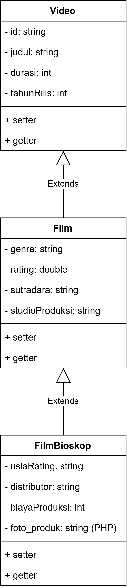

### 2. Diagram Kelas Mermaid
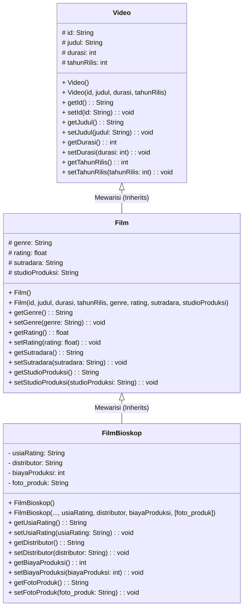
```mermaid
classDiagram
    direction BT

    class Video {
        # id: String
        # judul: String
        # durasi: int
        # tahunRilis: int
        + Video()
        + Video(id, judul, durasi, tahunRilis)
        + getId(): String
        + setId(id: String): void
        + getJudul(): String
        + setJudul(judul: String): void
        + getDurasi(): int
        + setDurasi(durasi: int): void
        + getTahunRilis(): int
        + setTahunRilis(tahunRilis: int): void
    }

    class Film {
        # genre: String
        # rating: float
        # sutradara: String
        # studioProduksi: String
        + Film()
        + Film(id, judul, durasi, tahunRilis, genre, rating, sutradara, studioProduksi)
        + getGenre(): String
        + setGenre(genre: String): void
        + getRating(): float
        + setRating(rating: float): void
        + getSutradara(): String
        + setSutradara(sutradara: String): void
        + getStudioProduksi(): String
        + setStudioProduksi(studioProduksi: String): void
    }

    class FilmBioskop {
        - usiaRating: String
        - distributor: String
        - biayaProduksi: int
        - foto_produk: String
        + FilmBioskop()
        + FilmBioskop(..., usiaRating, distributor, biayaProduksi, [foto_produk])
        + getUsiaRating(): String
        + setUsiaRating(usiaRating: String): void
        + getDistributor(): String
        + setDistributor(distributor: String): void
        + getBiayaProduksi(): int
        + setBiayaProduksi(biayaProduksi: int): void
        + getFotoProduk(): String
        + setFotoProduk(foto_produk: String): void
    }

    Film --|> Video : Mewarisi (Inherits)
    FilmBioskop --|> Film : Mewarisi (Inherits)
```

---

## Penjelasan Atribut dan Methods Setiap Kelas

### 1. Kelas `Video` (Kelas Dasar / Base Class)
Mendefinisikan entitas umum media rekaman audio-visual. Menggunakan hak akses `protected` agar atribut dapat diwariskan secara langsung ke kelas-kelas turunan di bawahnya (`Film` dan `FilmBioskop`).

| No | Nama Atribut | Tipe Data | Akses | Keterangan |
|:---:|:---|:---:|:---:|:---|
| 1 | `id` | String | `protected` | Kode/identitas unik pembeda antar video (misal: "V01") |
| 2 | `judul` | String | `protected` | Nama judul karya video |
| 3 | `durasi` | int | `protected` | Panjang durasi putar video dalam satuan menit |
| 4 | `tahunRilis` | int | `protected` | Tahun resmi karya video dirilis ke publik |

**Methods:**
- `Video()`: Konstruktor default untuk inisialisasi nilai awal kosong.
- `Video(id, judul, durasi, tahunRilis)`: Konstruktor berparameter untuk mengisi langsung 4 atribut kelas dasar.
- `getId(): String` & `setId(id: String): void`: Mengambil dan mengubah identitas ID film.
- `getJudul(): String` & `setJudul(judul: String): void`: Mengambil dan mengubah judul video.
- `getDurasi(): int` & `setDurasi(durasi: int): void`: Mengambil dan mengubah durasi video.
- `getTahunRilis(): int` & `setTahunRilis(tahunRilis: int): void`: Mengambil dan mengubah tahun rilis video.

---

### 2. Kelas `Film` (Kelas Turunan Tingkat 1 / Mewarisi `Video`)
Menambahkan atribut dan perilaku spesifik karya sinematografi terstruktur. Atribut menggunakan hak akses `protected` agar dapat diakses dan diwariskan ke kelas turunan berikutnya (`FilmBioskop`).

| No | Nama Atribut | Tipe Data | Akses | Keterangan |
|:---:|:---|:---:|:---:|:---|
| 1 | `genre` | String | `protected` | Kategori tema atau aliran film (misal: "Action", "Sci-Fi", "Animasi") |
| 2 | `rating` | float / double | `protected` | Skor penilaian kualitas film dari skala 0.0 sampai 10.0 |
| 3 | `sutradara` | String | `protected` | Nama tokoh sutradara pengarah film |
| 4 | `studioProduksi` | String | `protected` | Nama perusahaan rumah produksi yang mendanai/membuat film |

**Methods:**
- `Film()`: Konstruktor default memanggil konstruktor dasar.
- `Film(id, judul, durasi, tahunRilis, genre, rating, sutradara, studioProduksi)`: Konstruktor berparameter yang meneruskan atribut `Video` ke konstruktor induk (`super()` / `parent::__construct()`) dan menginisialisasi 4 atribut spesifik `Film`.
- `getGenre(): String` & `setGenre(genre: String): void`: Mengambil dan mengubah genre film.
- `getRating(): float` & `setRating(rating: float): void`: Mengambil dan mengubah skor rating film.
- `getSutradara(): String` & `setSutradara(sutradara: String): void`: Mengambil dan mengubah nama sutradara.
- `getStudioProduksi(): String` & `setStudioProduksi(studioProduksi: String): void`: Mengambil dan mengubah nama studio produksi.

---

### 3. Kelas `FilmBioskop` (Kelas Turunan Tingkat 2 / Mewarisi `Film`)
Menambahkan atribut spesifik untuk penayangan komersial bioskop layar lebar. Atribut menggunakan hak akses `private` karena `FilmBioskop` merupakan kelas daun (*leaf class* / level terbawah dalam hierarki pewarisan).

| No | Nama Atribut | Tipe Data | Akses | Keterangan |
|:---:|:---|:---:|:---:|:---|
| 1 | `usiaRating` | String | `private` | Batasan usia penonton (misal: "SU", "13+", "17+", "21+") |
| 2 | `distributor` | String | `private` | Nama perusahaan distributor penayangan bioskop |
| 3 | `biayaProduksi` | int | `private` | Anggaran biaya produksi film dalam satuan Juta Dollar ($) |
| 4 | `foto_produk` | String | `private` | *(Khusus PHP)* Nama file gambar poster film di folder `images/` |

**Methods:**
- `FilmBioskop()`: Konstruktor default.
- `FilmBioskop(id, judul, durasi, tahunRilis, genre, rating, sutradara, studioProduksi, usiaRating, distributor, biayaProduksi, [foto_produk])`: Konstruktor berparameter meneruskan atribut ke kelas induk `Film` dan menginisialisasi atribut penayangan bioskop.
- `getUsiaRating(): String` & `setUsiaRating(usiaRating: String): void`: Mengambil dan mengubah klasifikasi usia penonton.
- `getDistributor(): String` & `setDistributor(distributor: String): void`: Mengambil dan mengubah nama distributor.
- `getBiayaProduksi(): int` & `setBiayaProduksi(biayaProduksi: int): void`: Mengambil dan mengubah anggaran biaya produksi.
- `getFotoProduk(): String` & `setFotoProduk(foto_produk: String): void`: *(Khusus PHP)* Mengambil dan mengubah nama file poster.

---

## Sample Gambar Poster Film (PHP/images)

Katalog visual poster film yang disimpan di dalam direktori `PHP/images/`:

* **Avatar**:
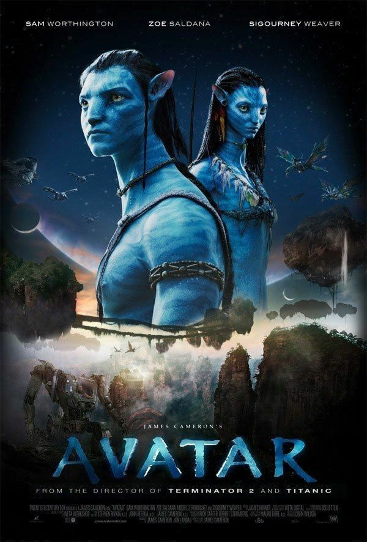

* **Frozen II**:
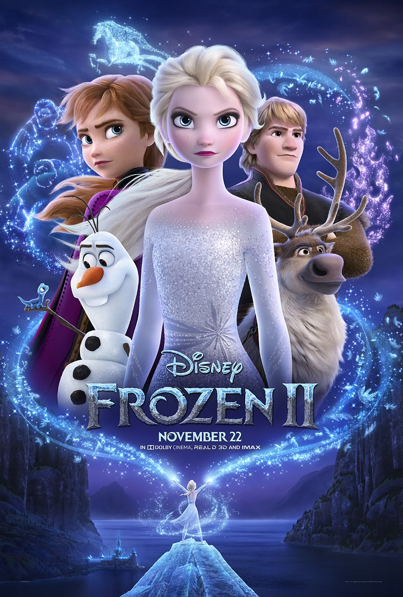

* **Oppenheimer**:
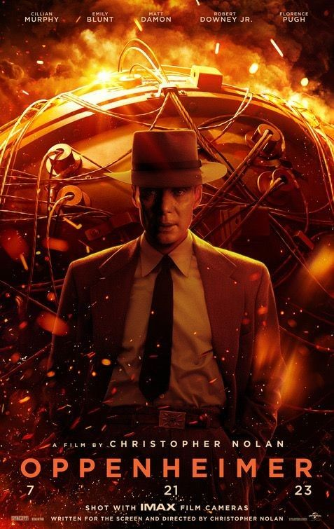

* **The Avengers**:


* **Titanic**:


* **Zootopia 2**:
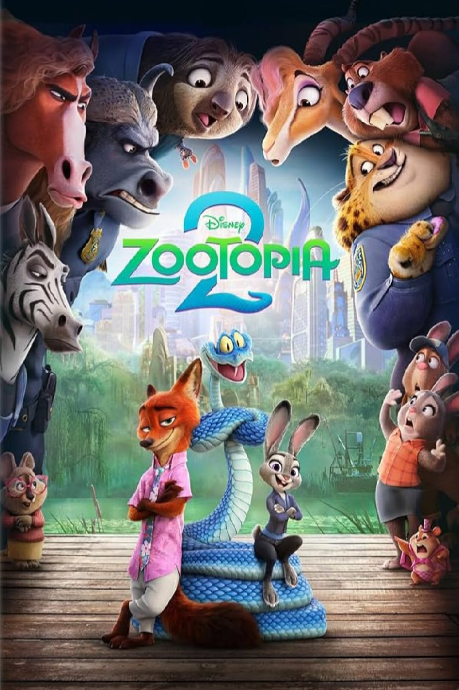

---

## Flow Kode Program

```text
┌────────────────────────────────────────────────────────────────────────┐
│                             START PROGRAM                              │
└───────────────────────────────────┬────────────────────────────────────┘
                                    │
                                    ▼
┌────────────────────────────────────────────────────────────────────────┐
│             INISIALISASI 5 OBJEK AWAL FILMBIOKOP DI MEMORI             │
│   (V01 s.d. V05 langsung terdaftar pada memori sebelum input user)     │
└───────────────────────────────────┬────────────────────────────────────┘
                                    │
                                    ▼
┌────────────────────────────────────────────────────────────────────────┐
│                     MENAMPILKAN BANNER & MENU UTAMA                    │
│   [1] Tambah Data Film (Add)   [2] Tampilkan Tabel (Show)   [3] Keluar │
└───────────────────────────────────┬────────────────────────────────────┘
                                    │
                                    ▼
┌────────────────────────────────────────────────────────────────────────┐
│                        INPUT PILIHAN DARI USER                         │
└──────────────┬────────────────────┬────────────────────┬───────────────┘
               │                    │                    │
               ▼                    ▼                    ▼
     [1] Tambah Data        [2] Tampilkan Data       [3] Keluar
               │                    │                    │
               │                    │                    ▼
               │                    │         ┌──────────────────────────┐
               │                    │         │ Menampilkan Pesan Outro  │
               │                    │         │ dan Mengakhiri Program   │
               │                    │         └──────────────────────────┘
               │                    │
               ▼                    ▼
 ┌───────────────────────────┐ ┌─────────────────────────────────────────┐
 │   VALIDASI INPUT USER:    │ │     PERHITUNGAN LEBAR KOLOM DINAMIS     │
 │ - ID wajib unik           │ │     (Auto-Fit berdasarkan data terpanjang│
 │ - Teks tidak boleh kosong │ └────────────────────┬────────────────────┘
 │ - Durasi: 1 - 1000 menit  │                      │
 │ - Tahun: 1888 - 2100      │                      ▼
 │ - Rating: 0.0 - 10.0      │ ┌─────────────────────────────────────────┐
 │ - Biaya: >= 0             │ │    CETAK TABEL LENGKAP DALAM 1 TABEL    │
 └─────────────┬─────────────┘ │ (11 Kolom atribut lengkap di CLI atau   │
               │               │  12 Kolom lengkap + Poster di Web PHP)  │
               ▼               └────────────────────┬────────────────────┘
 ┌───────────────────────────┐                      │
 │ Buat Objek FilmBioskop &  │                      │
 │ Simpan ke List/Vector     │                      │
 └─────────────┬─────────────┘                      │
               │                                    │
               └─────────────────┬──────────────────┘
                                 │
                                 ▼
               ┌───────────────────────────────────┐
               │    KEMBALI KE MENU UTAMA SISTEM   │
               └───────────────────────────────────┘
```

1. **Inisialisasi 5 Data Bawaan**: Saat program pertama kali dijalankan, sistem otomatis memasukkan 5 data film bioskop awal ke dalam memori (`std::vector` pada C++, `ArrayList` pada Java, `list` pada Python, dan `$_SESSION` pada PHP).
2. **Pilihan Menu Utama**: Menampilkan menu navigasi interaktif. Pengguna diarahkan memilih menu `[1] Tambah Data`, `[2] Tampilkan Seluruh Data`, atau `[3] Keluar dari Program`.
3. **Validasi & Penanganan Eror**: Setiap tahapan input masukan user divalidasi secara ketat oleh sistem: mencegah ID ganda, teks kosong, durasi nol/negatif, tahun tidak valid, dan skor rating di luar jangkauan.
4. **Eksekusi Penambahan Data**: Objek `FilmBioskop` baru diinstansiasi secara dinamis melalui pewarisan bertingkat dan dimasukkan ke dalam daftar koleksi data.
5. **Penyajian Tabel Dinamis**: Saat memilih menu tampilkan, sistem menghitung lebar string terpanjang pada masing-masing kolom data untuk mencetak garis pembatas dan isi tabel yang simetris, presisi, serta mudah dibaca.

---

## Penjelasan Fitur Utama

| Fitur | Deskripsi |
|:---|:---|
| **Tambah Data (Add Saja)** | Menerima masukan dari pengguna secara interaktif untuk menambahkan objek film bioskop baru ke dalam database memori. Menjalankan validasi menyeluruh pada 11 atribut data (+ 1 atribut foto pada PHP). |
| **Tampilkan Data (Show Table)** | Menyajikan seluruh data dari ketiga kelas (`Video`, `Film`, dan `FilmBioskop`) secara transparan dan lengkap di dalam **satu tabel utuh** dengan perhitungan lebar kolom otomatis (*dynamic auto-width formatting*). |
| **Keluar dari Program (Exit)** | Menghentikan eksekusi perulangan menu utama secara aman dengan menampilkan banner penutup (*outro*). |
| **Reset Data Default (Khusus PHP)** | Aksi pemulihan cepat untuk mengembalikan seluruh isi tabel ke 5 data default awal bawaan sistem. |

---

## Dokumentasi Output Program C++

### Cara Kompilasi dan Menjalankan

```bash
cd CPP/
g++ main.cpp -o main
./main
```

> *Catatan: Cukup mengompilasi `main.cpp` karena seluruh file kelas (`FilmBioskop.cpp`, `Film.cpp`, dan `Video.cpp`) telah di-`#include` secara berantai.*
>
> **Menjalankan dengan testcase otomatis:**
> ```bash
> Get-Content file.txt | ./main
> ```

### 1. Banner Pembuka & Menu Utama
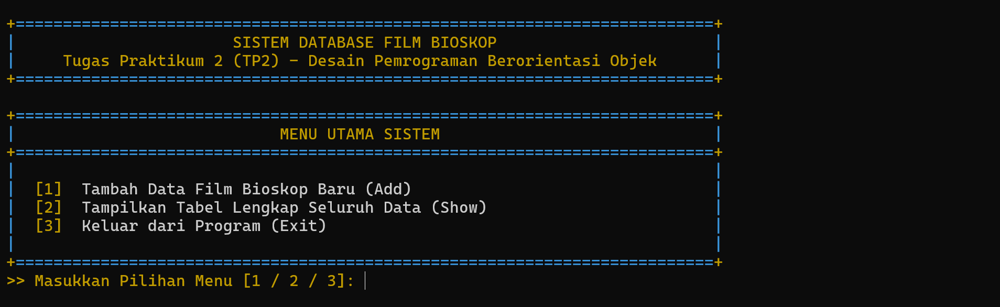

### 2. Tampilan Tabel Data Awal (5 Objek Bawaan)
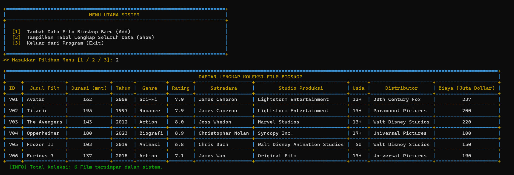

### 3. Menambahkan Data Film Baru (Tambah Data V06)
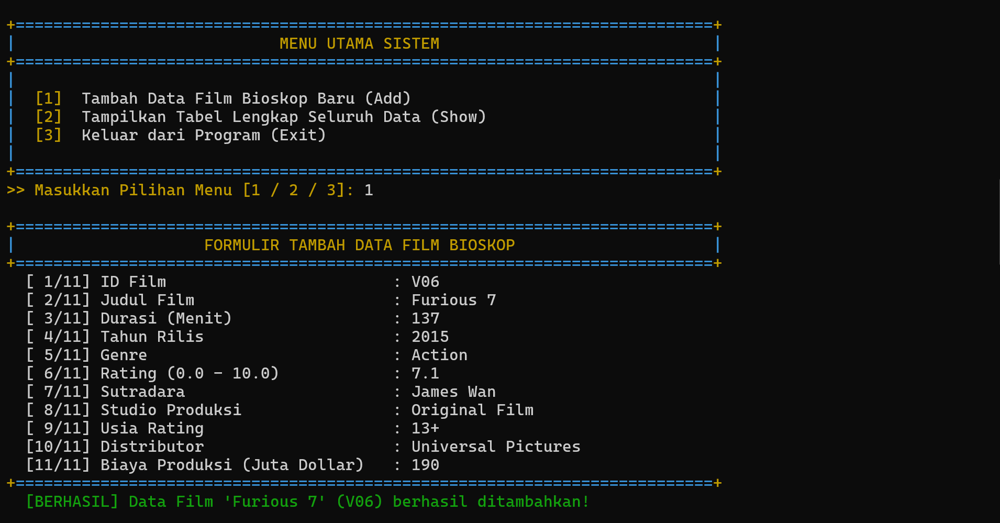

### 4. Tampilan Tabel Lengkap Setelah Ditambah
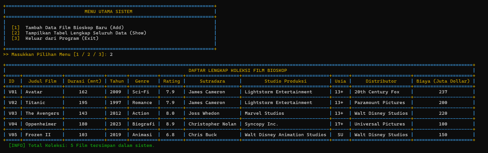

### 5. Keluar dari Program
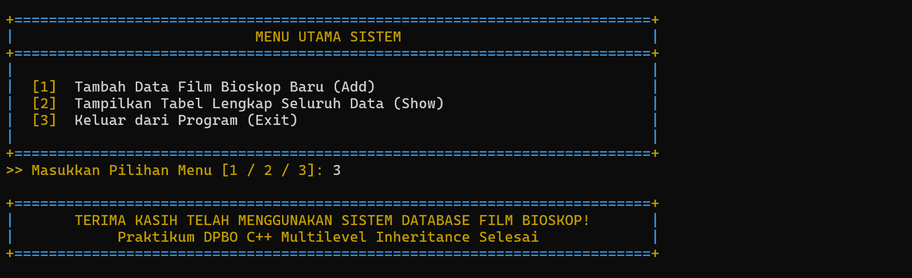

---

## Dokumentasi Output Program Java

### Cara Kompilasi dan Menjalankan

```bash
cd Java/
javac Main.java
java Main
```

> *Catatan: Cukup mengompilasi `Main.java` karena compiler Java (`javac`) secara otomatis mengompilasi seluruh kelas dependen (`Video.java`, `Film.java`, `FilmBioskop.java`) yang berada pada folder yang sama.*
>
> **Menjalankan dengan testcase otomatis:**
> ```bash
> Get-Content file.txt | java Main
> ```

### 1. Banner Pembuka & Menu Utama
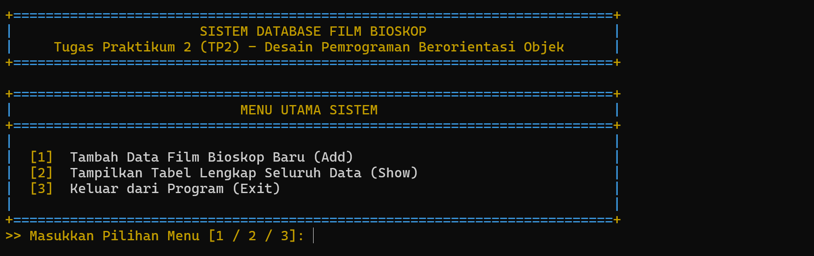

### 2. Tampilan Tabel Data Awal (5 Objek Bawaan)
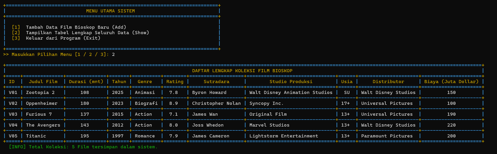

### 3. Menambahkan Data Film Baru (Tambah Data V06)
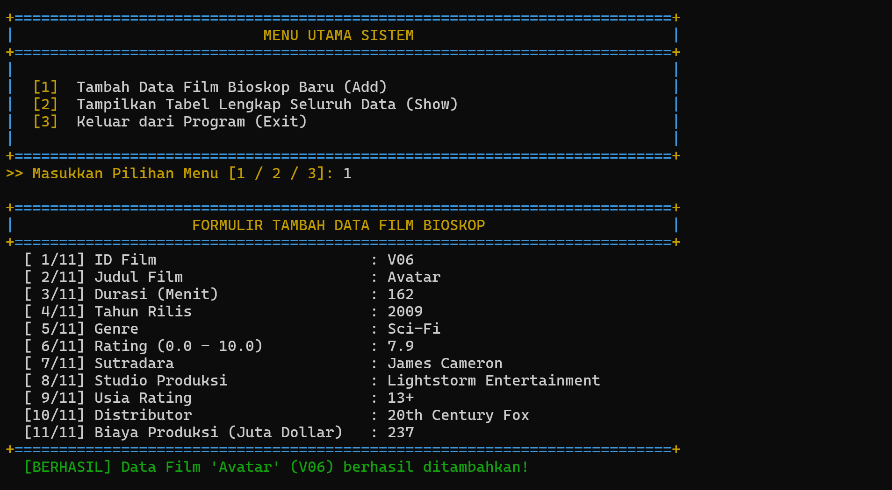

### 4. Tampilan Tabel Lengkap Setelah Ditambah
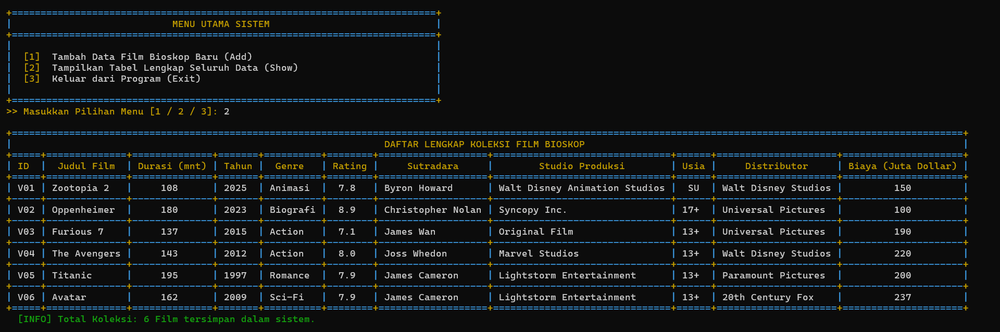

### 5. Keluar dari Program
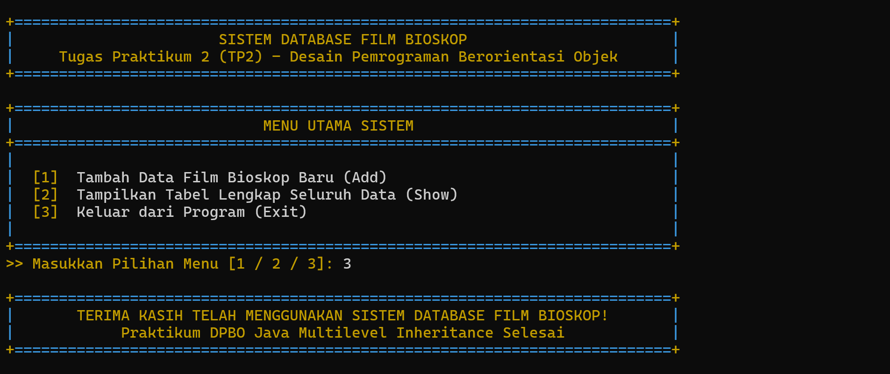

---

## Dokumentasi Output Program Python

### Cara Menjalankan

```bash
cd Python/
python main.py
```

> **Menjalankan dengan testcase otomatis:**
> ```bash
> Get-Content file.txt | python main.py
> ```

### 1. Banner Pembuka & Menu Utama
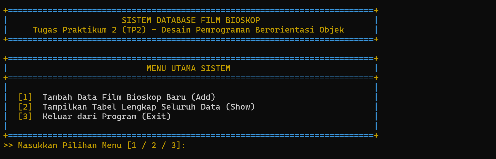

### 2. Tampilan Tabel Data Awal (5 Objek Bawaan)
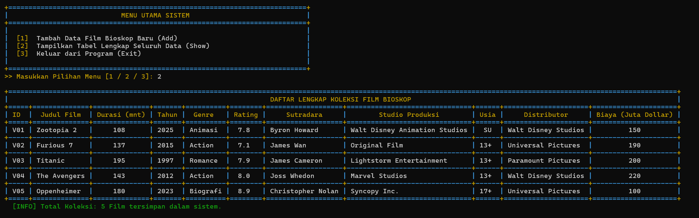

### 3. Menambahkan Data Film Baru (Tambah Data V06)
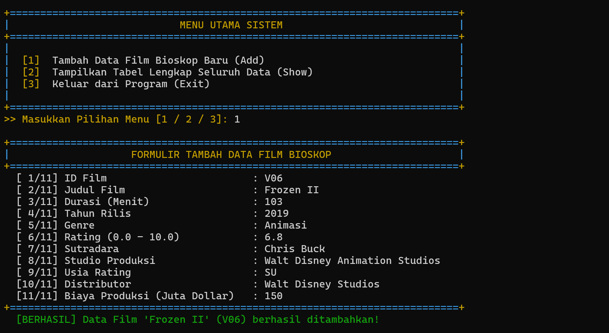

### 4. Tampilan Tabel Lengkap Setelah Ditambah
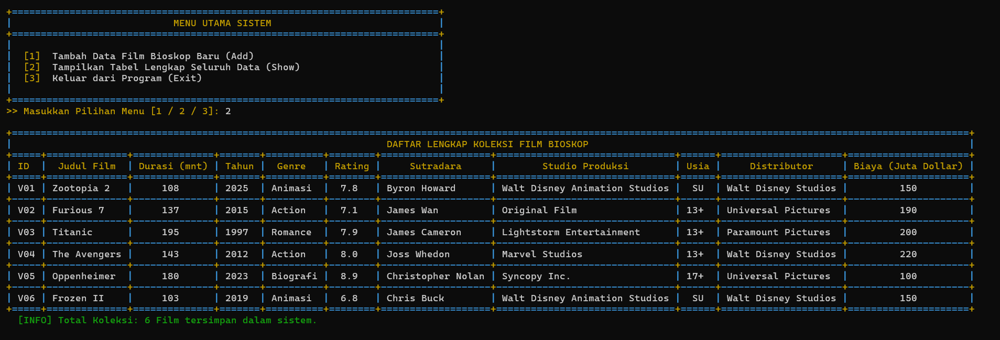

### 5. Keluar dari Program
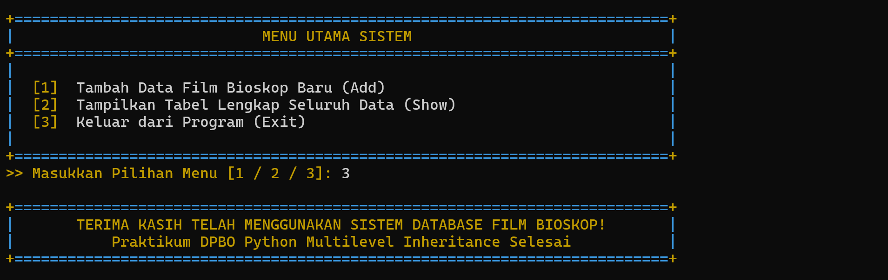

---

## Dokumentasi Output Program PHP (Web UI)

### Cara Menjalankan

```bash
cd PHP/
php -S localhost:8000
```

Buka peramban (*browser*) dan akses alamat: `http://localhost:8000/index.php`.

### 1. Tampilan Dashboard & Tabel Data Awal
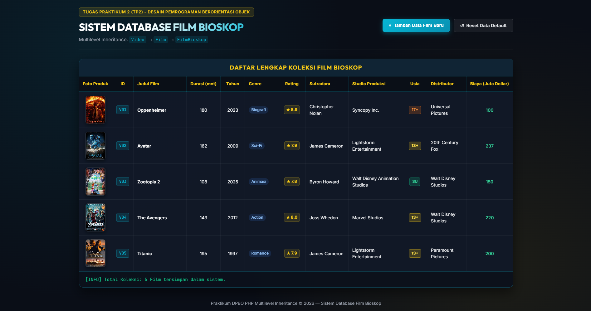

### 2. Formulir Tambah Data (Modal Dialog)
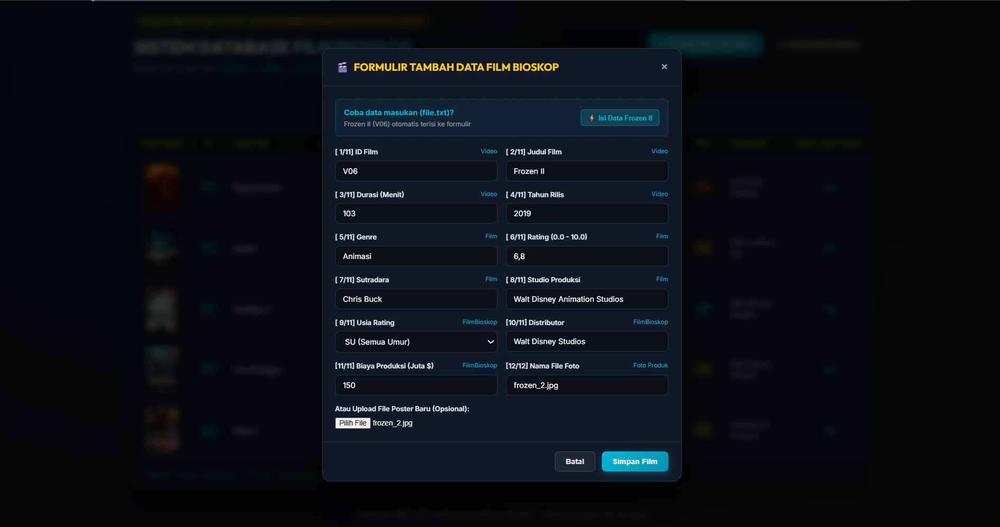

### 3. Tampilan Tabel Lengkap Setelah Ditambah
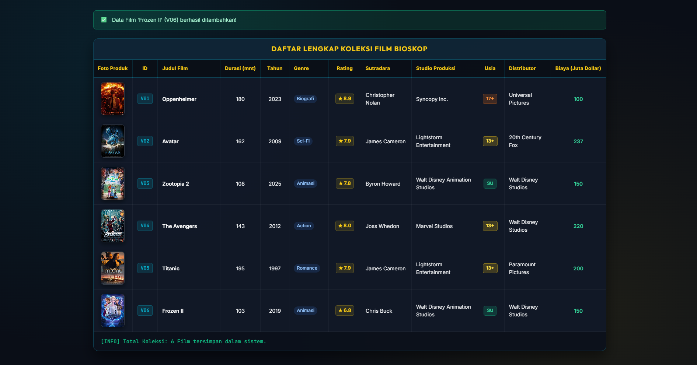

### 4. Reset Data ke Default Awal
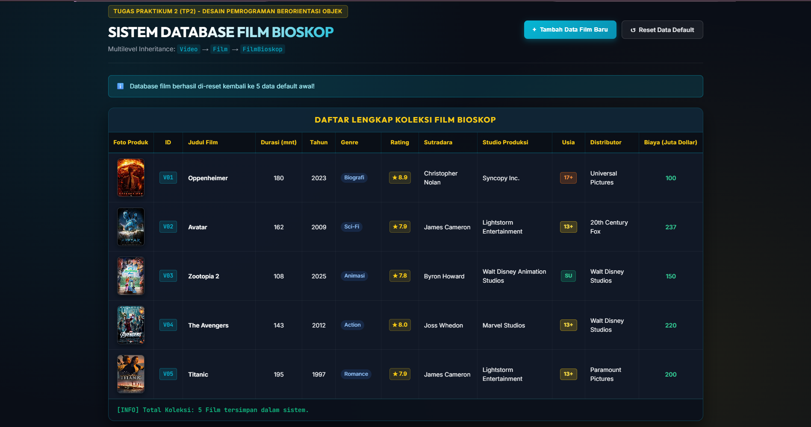

---

## Dokumentasi Penanganan Eror (Error Handling)

Bagian ini menyajikan secara mendalam seluruh skenario pengujian penanganan eror (*error handling*) beserta tangkapan layar verifikasinya pada seluruh bahasa pemrograman:

### Rincian Atribut Berdasarkan Tipe Validasi Eror

#### A. Seluruh Atribut String yang Dilarang Kosong (Non-Empty Validation)
Pada saat pengisian data (Add), sistem secara ketat memverifikasi bahwa masukan tidak boleh string kosong, hanya spasi (*whitespace*), ataupun karakter kontrol. Atribut-atribut tersebut meliputi:
1. **`id` (ID Film)**: Tidak boleh kosong dan tidak boleh sama dengan ID yang telah ada (*unique key*).
2. **`judul` (Judul Film)**: Wajib berisi teks nama film yang valid.
3. **`genre` (Genre Film)**: Wajib berisi kategori/tema film.
4. **`sutradara` (Nama Sutradara)**: Wajib berisi nama pengarah adegan film.
5. **`studioProduksi` (Studio Produksi)**: Wajib berisi nama rumah produksi pembuat film.
6. **`usiaRating` (Usia Rating)**: Wajib berisi klasifikasi usia penonton resmi ("SU", "13+", "17+", "21+").
7. **`distributor` (Distributor)**: Wajib berisi nama perusahaan penyalur film bioskop.

#### B. Seluruh Atribut Numerik Berdasarkan Rentang Nilai
1. **`durasi`**: Wajib bertipe bilangan bulat (*integer*) dengan rentang **1 s.d. 1000 menit**.
2. **`tahunRilis`**: Wajib bertipe bilangan bulat (*integer*) dengan rentang **1888 s.d. 2100**.
3. **`biayaProduksi`**: Wajib bertipe bilangan bulat (*integer*) non-negatif dengan rentang **&ge; 0 Juta Dollar**.
4. **`rating`**: Wajib bertipe angka desimal (*float/double*) dengan rentang skor **0.0 s.d. 10.0**.

#### C. Validasi Berkas Gambar (*Khusus PHP*)
File unggahan poster wajib memiliki ekstensi berkas yang valid: **JPG, JPEG, PNG, WEBP, atau GIF**.

---

### A. Program CLI (C++, Java, dan Python)

#### 1. Input Pilihan Menu Tidak Valid
Menolak masukan angka di luar menu (seperti `0`, `4`, `99`) ataupun karakter huruf/simbol:


#### 2. Duplikasi ID Film (Primary Key Check)
Menolak ID film yang telah terdaftar di database secara *case-insensitive*:


#### 3. Masukan Teks Kosong (Empty / Whitespace-Only Validation)
Menolak inputan string kosong saat user langsung menekan tombol enter:


#### 4. Durasi Di Luar Rentang Nilai (1 - 1000 Menit)
Menolak angka durasi nol, negatif, ataupun di atas 1000 menit:


#### 5. Tahun Rilis Di Luar Rentang Nilai (1888 - 2100)
Menolak angka tahun di bawah sejarah penemuan film bioskop (1888) atau di atas batas kewajaran (2100):


#### 6. Biaya Produksi Di Luar Rentang Nilai (Angka Negatif)
Menolak nilai biaya produksi yang kurang dari nol ($< 0$):


#### 7. Rating Film Di Luar Rentang Nilai (0.0 - 10.0)
Menolak nilai rating di bawah 0.0 ataupun di atas 10.0:


---

### B. Program PHP (Web UI)

#### 1. Duplikasi ID Film Saat Menambah Data
* **Pemberitahuan Validasi Error pada Formulir (Kondisi 1)**:


* **Pesan Notifikasi Kesalahan Sistem (Kondisi 2)**:


#### 2. Masukan Teks Kosong (HTML5 Validation & Server-Side Validation)
Memastikan seluruh field string wajib terisi:


#### 3. Durasi Di Luar Rentang Nilai
* **Peringatan Batas Durasi pada Input (Kondisi 1)**:


* **Respon Validasi Form (Kondisi 2)**:


#### 4. Rating Di Luar Rentang Nilai (0.0 - 10.0)
* **Validasi Nilai Rating (Kondisi 1)**:


* **Peringatan Nilai Maksimum (Kondisi 2)**:


#### 5. Tahun Rilis Di Luar Rentang Nilai
* **Pemeriksaan Batas Minimum Tahun (Kondisi 1)**:


* **Pemeriksaan Batas Maksimum Tahun (Kondisi 2)**:


#### 6. Biaya Produksi Di Luar Rentang Nilai
* **Pencegahan Nilai Biaya Negatif (Kondisi 1)**:


* **Respon Peringatan Angka Non-Negatif (Kondisi 2)**:


#### 7. Format Berkas Unggahan Foto Tidak Didukung
Menolak berkas non-gambar yang diunggah ke dalam sistem:

